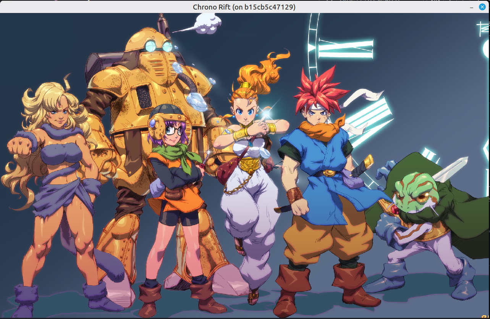
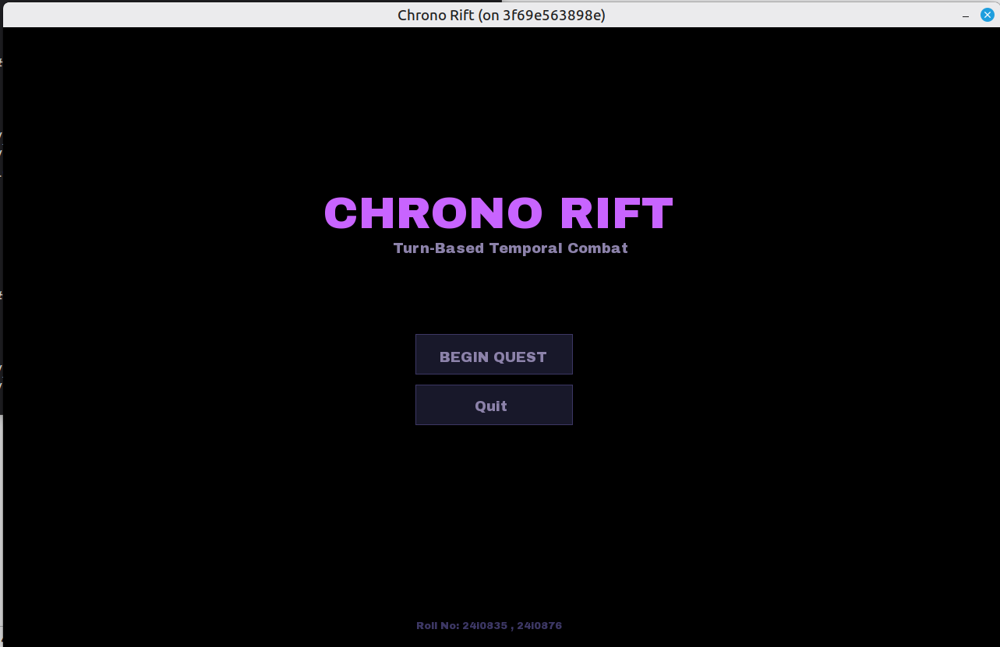
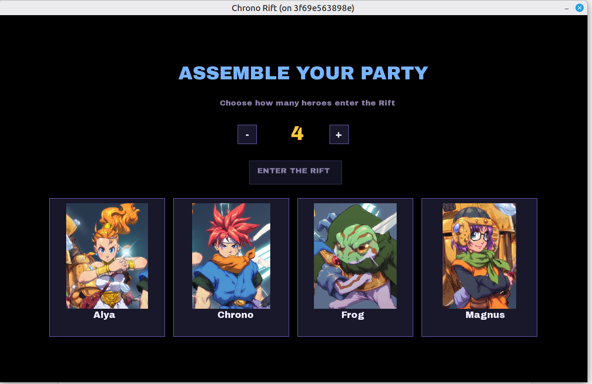
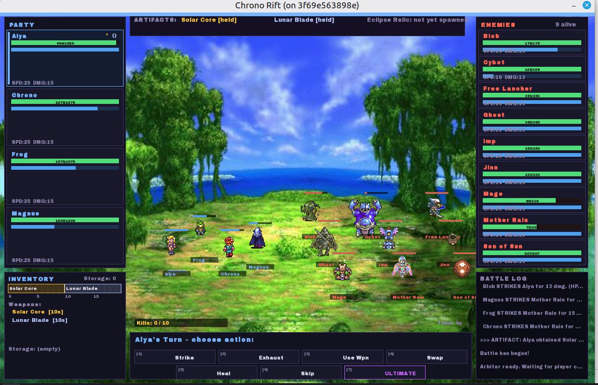
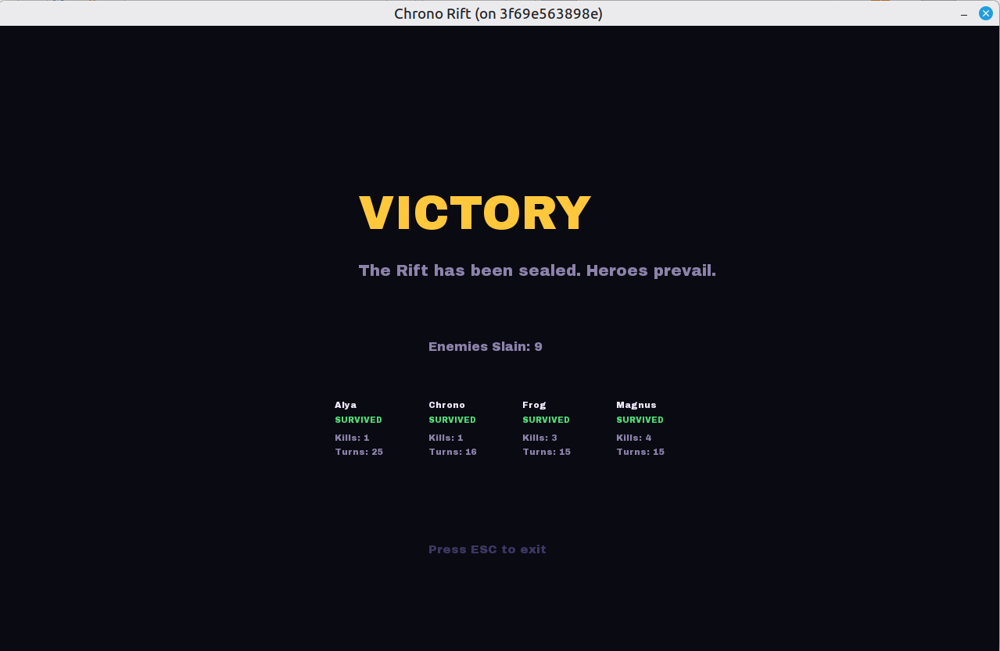
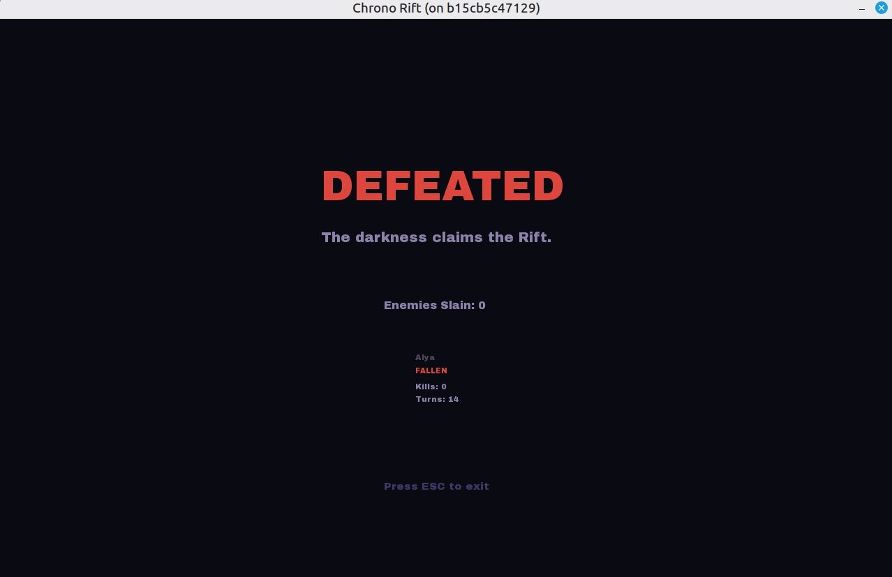

# ⚔️ ChronoRift

> A turn-based combat game built as an **Operating Systems course project**, focused on multi-process architecture, shared memory IPC, POSIX semaphores, pthreads, and UNIX signal handling. Three processes communicate via shared memory with a stamina-based turn scheduler. SFML for frontend only.

---

## 📸 Screenshots

### Splash Screen


### Main Menu


### Player Selection


### Gameplay


### Victory Screen


### Defeat Screen


---

## 🧠 OS Concepts Demonstrated

| Concept | Implementation |
|---|---|
| Multi-process architecture | Arbiter, HIP, ASP as separate processes |
| Shared memory | `shmget` / `shmat` — single segment owned by Arbiter |
| Synchronization | POSIX semaphores — per-entity turn sems + global state lock |
| Threading | `pthreads` — one thread per player, one per enemy |
| Scheduling | Stamina-based ATB scheduler inside Arbiter |
| Signals | `SIGUSR1` stun, `SIGSTOP`/`SIGCONT` ultimate, `SIGTERM` shutdown |
| Deadlock handling | Dedicated deadlock monitor thread |
| IPC | All game state flows through shared memory only |

---

## 🏗️ Architecture

```
┌─────────────────────────────────────────────────┐
│                  SHARED MEMORY                  │
│         (SharedData — shmget/shmat)             │
└────────────┬──────────────────┬─────────────────┘
             │                  │
     ┌───────▼──────┐   ┌───────▼──────┐
     │     HIP      │   │     ASP      │
     │ Human Input  │   │  AI / Enemy  │
     │   Process    │   │   Process    │
     │              │   │              │
     │ 1 thread per │   │ 1 thread per │
     │    player    │   │    enemy     │
     │ + SFML UI    │   │              │
     └───────┬──────┘   └───────┬──────┘
             │                  │
     ┌───────▼──────────────────▼──────┐
     │             ARBITER             │
     │   - Owns shared memory          │
     │   - Turn scheduler (ATB)        │
     │   - Processes all actions       │
     │   - Manages game state          │
     │   - Deadlock monitor thread     │
     └─────────────────────────────────┘
```

- **Arbiter** — central authority. Owns and initializes shared memory, runs the stamina-based turn scheduler, and processes every action submitted by HIP and ASP.
- **HIP (Human Input Process)** — spawns one thread per player. Each thread sleeps on a semaphore until the scheduler grants that player a turn. The main thread runs the SFML UI.
- **ASP (AI Side Process)** — mirrors HIP for enemies. Each enemy thread autonomously picks a target and submits an action.

---

## 🎮 How to Run

### Requirements
- Docker
- An X11 display (Linux)

### Steps

```bash
# Allow Docker to access your display
xhost +local:docker

# Run the container
docker run -it --rm \
  --privileged \
  -e DISPLAY=$DISPLAY \
  -v /tmp/.X11-unix:/tmp/.X11-unix \
  -v $(pwd):/app \
  --device /dev/snd \
  --device /dev/dri \
  chrono-rift-env

# Inside the container
make

# Launch all three processes
./bin/arbiter & ./bin/hip & ./bin/asp
```

---

## ⚔️ Game Mechanics

### Actions Per Turn

| Action | Description |
|---|---|
| **Strike** | Basic attack using the hero's base damage stat |
| **Exhaust** | Drains enemy stamina instead of HP — delays their next turn |
| **Use Weapon** | Attack with an equipped weapon for significantly higher damage |
| **Swap** | Bring a weapon from storage into active inventory — consumes your turn |
| **Heal** | Restore 10% of the hero's max HP |
| **Skip** | Forfeit turn but restore half stamina — useful for turn manipulation |
| **Ultimate** | Requires Solar Core + Lunar Blade — freezes all enemies for 10 real seconds |

### Ultimate Ability
Requires the player to hold both the **Solar Core** and **Lunar Blade** artifacts. On use, sends `SIGSTOP` to the ASP process — physically suspending all enemy threads at the OS level for **10 seconds**. A `SIGALRM` fires after the window to send `SIGCONT` and resume the ASP.

### Inventory & Storage
- Each weapon occupies a variable number of **contiguous slots** (2–10) out of 20 total
- New weapons auto-evict the smallest weapon(s) to storage if space is needed
- **Storage** holds weapons that don't fit in active inventory
- **Swap** action brings a stored weapon back into active inventory, using your turn

### Weapon Drops
Killing an enemy triggers a random weapon drop. The killing player gets a timed **accept/decline popup**. Declining gives the weapon to a random surviving enemy.

### Artifacts
Three special items exist in the Rift — **Solar Core**, **Lunar Blade**, and **Eclipse Relic**. Pickup uses a mutex-style locking and waiting mechanism built directly on the shared memory struct. The Eclipse Relic unlocks after 2 total enemy kills.

### Stun
Any attack has a random chance to stun the target. Stun duration is tracked with `time()` and `SIGUSR1` is sent to the target's process to interrupt it.

---
### Game Over Conditions
| Condition        | Result                    |
| ---------------- | ------------------------- |
| All players dead | **Defeat** — enemies win  |
| All enemies dead | **Victory** — players win |
| Player quits     | **Abandoned** — no winner |


---
## 🧍 Heroes & Enemies

### Heroes
| Hero |
|---|
| Alya |
| Chrono |
| Frog |
| Magnus |

### Enemies
| Enemy |
|---|
| Blob |
| Cybot |
| Free Lancer |
| Ghost |
| Imp |
| Jinn |
| Mage |
| Mother Rain |
| Son of Sun |

---

## 🗡️ Weapons

| Weapon | Slots | Damage |
|---|---|---|
| Solar Core | 10 | 95 |
| Lunar Blade | 10 | 90 |
| Eclipse Relic | 8 | 85 |
| Iron Halberd | 7 | 55 |
| Thunderstaff | 6 | 50 |
| Frostbow | 6 | 48 |
| Obsidian Axe | 5 | 45 |
| Venom Dagger | 4 | 30 |
| Splinter Stick | 2 | 12 |

---

## 🧪 Headless Mode

For testing without a display:

```bash
CHRONO_HEADLESS=1 ./bin/hip
# Force exhaust-only AI policy:
CHRONO_HEADLESS_POLICY=exhaust CHRONO_HEADLESS=1 ./bin/hip
```

---

## 📁 Project Structure

```
├── arbiter.cpp          # Central game engine process
├── hip/
│   ├── hip.cpp          # Human input process + SFML UI
│   ├── ui.h             # Layout, palette, screen enums
│   ├── ui_renderer_full.h  # Full SFML renderer
│   └── inventory_logic.h   # Inventory placement algorithm
├── asp.cpp              # AI enemy process
├── Makefile
├── Dockerfile
├── common.h             # Shared structs, constants, defines
└── Data/                # Assets (fonts, sprites, background)
```

---

## 🛠️ Built With

- **C++** — core language
- **POSIX** — shared memory, semaphores, signals, pthreads
- **SFML** — rendering only
- **Docker** — containerized build and run environment

---
